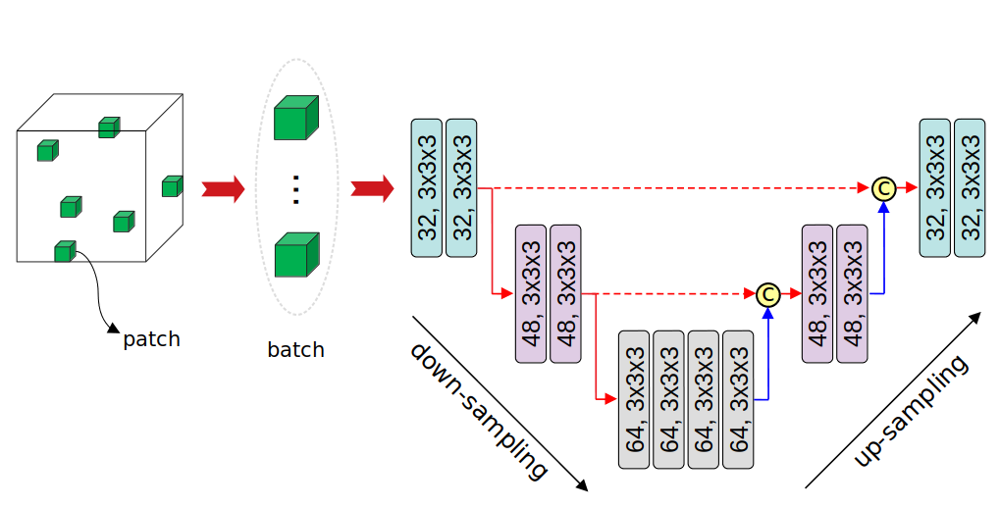

A Modified version of 3D-UNet

# Volumetric Macromolecule Identification in Cryo-Electron Tomograms using 3D-UNet

we employ capsule-based architecture to automate the task of macromolecule identification, that we refer to as 3D-UCaps. 3D-UCaps is a voxel-based Capsule network for medical image segmentation. In particular, the architecture is composed of three components: feature extractor, capsule encoder, and CNN decoder. The feature extractor converts voxel intensities of input sub-tomograms to activities of local features. The encoder is a 3D Capsule Network (CapsNet) that takes local features to generate a low-dimensional representation of the input. Then, a 3D CNN decoder reconstructs the sub-tomograms from the given representation by upsampling.



Details of the 3D-UCaps model architecture can be found here:

## Cite
If you use this code for your research, please cite as:
```

```
```

